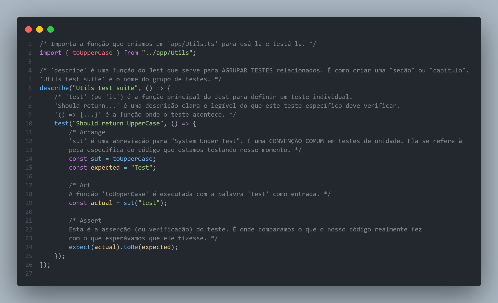
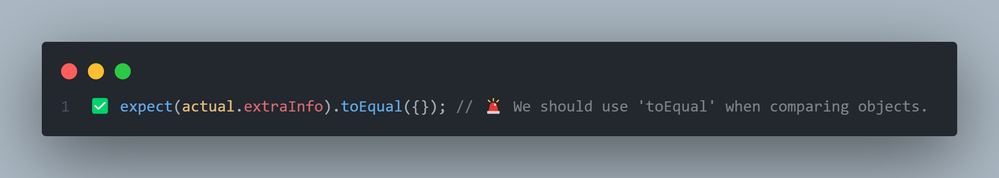

# Structure of a properly written unit test

## AAA principles

- **Arrange**: Set up the test environment and data.

- **Act**: Perform the action or call the function being tested.

- **Assert**: Verify the outcome of the action.

There are two more parts:

- **Setup**

- **Teardown**

## Sut

*'Sut'* é uma abreviação para **"System Under Test"**. Uma convenção comum em *testes de unidade*.

### Por que usar Sut?

- Quando vemos *sut* em um teste, imediatamente sabemos que aquela é a parte do código que está sendo o foco da verificação.
- Ajuda a manter os testes padronizados.
- Se o nome da função, por exemplo, "toUpperCase" mudar no futuro, vamos precisar atualizar somente a linha:
``const sut = toUpperCase;`` e o restante do nosso teste continuaria funcionando sem alterações.

## Expected

*'Expected'* é uma variável que armazena o **resultado que esperamos** da função que estamos testando.

### Por que usar Expected?

- Antes mesmo de executar a função (Act), já sabemos qual resultado deveria ser.
- Usar uma variável *expected* no lugar de um valor literal diretamente na asserção torna o teste mais legível.
- Da mesma forma acima, se a lógica da nossa função mudasse, vamos precisar atualizar somente o valor de *expected*.

## Actual

*'Actual'* é uma variável que armazena o **resultado real** retornado pela função que estamos testando.

### Por que usar Actual?

- O propósito fundamental é chamar a função ou o código que estamos testando e capturar o valor que ela retorna.
- Ao isolar essa chamada na fase **Act**, deixamos claro que este é o momento onde a ação principal do teste ocorre.
- O valor armazenado em *actual* será usado na próxima fase (Assert), para ser comparado com o *expected*.

## toEqual vs. toBe para Objetos em TypeScript/Jest

Quando comparamos objetos em testes com Jest, a escolha entre *toEqual* e *toBe* é crucial por causa de como o JavaScript lida com a igualdade de objetos.

### toBe (Igualdade Estrita ===)

- Verifica se duas variáveis apontam para o **MESMO** objeto na memória.
- Para objetos, **ele quase sempre falha**, mesmo que os objetos tenham o mesmo conteúdo, porque eles são instâncias diferentes na memória.

### toEqual (Igualdade Profunda)

- Verifica se o **CONTEÚDO** dos objetos é idêntico, propriedade por propriedade, recursivamente. Não importa se os objetos estão em locais de memória diferentes.
- **É o que geralmente queremos para objetos em testes.** Queremos saber se a *estrutura de dados* e os *valores* dentro dela estão corretos, não se é a exata mesma instância de objeto que foi criada.

## F.I.R.S.T. Principles

Os princípios F.I.R.S.T. são um conjunto de diretrizes que visam tornar os testes automatizados mais eficazes e fáceis de manter. Eles são amplamente aplicados em diversos frameworks de teste, incluindo o Jest.

### Fast

Os testes devem ser rápidos para serem executados. Testes lentos desmotivam os desenvolvedores a executá-los com frequência, o que pode levar à detecção tardia de problemas.

- Ciclos de feedback rápidos são cruciais para o desenvolvimento ágil.

#### Fast no Jest

- Evitar dependências externas - Mnimizar chamadas a banco de dados, APIs externas ou sistemas de arquivos reais. Usar **mocks** e **stubs** para simular esses comportamentos.
- Testar unidades isoladas - O nosso foco deve estar em pequenas unidades de código de forma isolada, sem carregar todo o sistema.
- Otimizar o ambiente de teste - Configurar o Jest para rodar apenas os testes relevantes ou para usar o *watch mode*, que executa apenas os testes relacionados aos arquivos alterados.

### Isolated

Cada teste deve ser **isolado** e independente dos outros. Isso significa que a ordem de execução dos testes não deve importar, e um teste não deve ter efeitos colaterais que afetem o resultado de outro.

#### Isolated no Jest

- Limpar o estado - É necessário nos certificarmos de que cada teste comece com um estado limpo. Podemos usar **beforeEach** e **afterEach** para configurar e limpar o ambiente para cada teste individualmente.
- Evitar estado global - Não é bom criar variáveis globais que possam ser modificadas por diferentes testes.
- Mocks e stubs - Novamente, usar **mocks** e **stubs**.

### Repeatable

Os testes devem ser **repetíveis**, ou seja, devem produzir o mesmo resultado toda vez que são executados, independentemente do ambiente (máquina local, servidor de integração contínua, etc.) ou da hora.

#### Repeatable no Jest

- Evitar dependências externas imprevisíveis - Novamente, é bom utilizar **mocks** para fontes de dados externas que possam variar (como APIs de terceiros com dados dinâmicos ou bancos de dados).
- Controlar o tempo - Se o nosso código lida com datas ou horários, é bom usarmos ferramentas de mock de tempo para garantir que os testes se comportem de forma consistente.
- Gerenciamento de dependências - Garantir que todas as dependências do projeto estejam versionadas e sejam instaladas de forma consistente em todos os ambientes.

### Self-validating

Os testes devem ser auto-validáveis, o que significa que o resultado de um teste deve ser claro: ou ele passa ou ele falha. Não deve ser necessário um humano para interpretar o resultado.

#### Self-validating no Jest

- Uso de assertions claras - Utilizar as funções de *expect* do Jest com matchers apropriados (*toBe, toEqual, toContain*) para verificar os resultados de forma programática.
- Mensagens de erro significativas - Embora o Jest forneça mensagens padrão, é necessário nos certificarmos de que os testes falhem com mensagens que ajudem a identificar o problema rapidamente.

### Thorough

Os testes devem ser **abrangentes** e cobrir todos os aspectos importantes do código, incluindo casos de sucesso, casos de falha, condições de limite e caminhos de erro.

#### Thorough no Jest

- Cobertura de código - Usar ferramentas de cobertura de código para identificar áreas do nosso código que não estão sendo testadas.
- Testar diferentes cenários - Pensar em todos os possíveis inputs e estados que nosso código pode receber e escrever testes para cada um deles.
- Testes de regressão - Sempre que um bug for encontrado e corrigido, devemos escrever um teste para reproduzir esse bug e garantir que ele não volte a ocorrer no futuro.