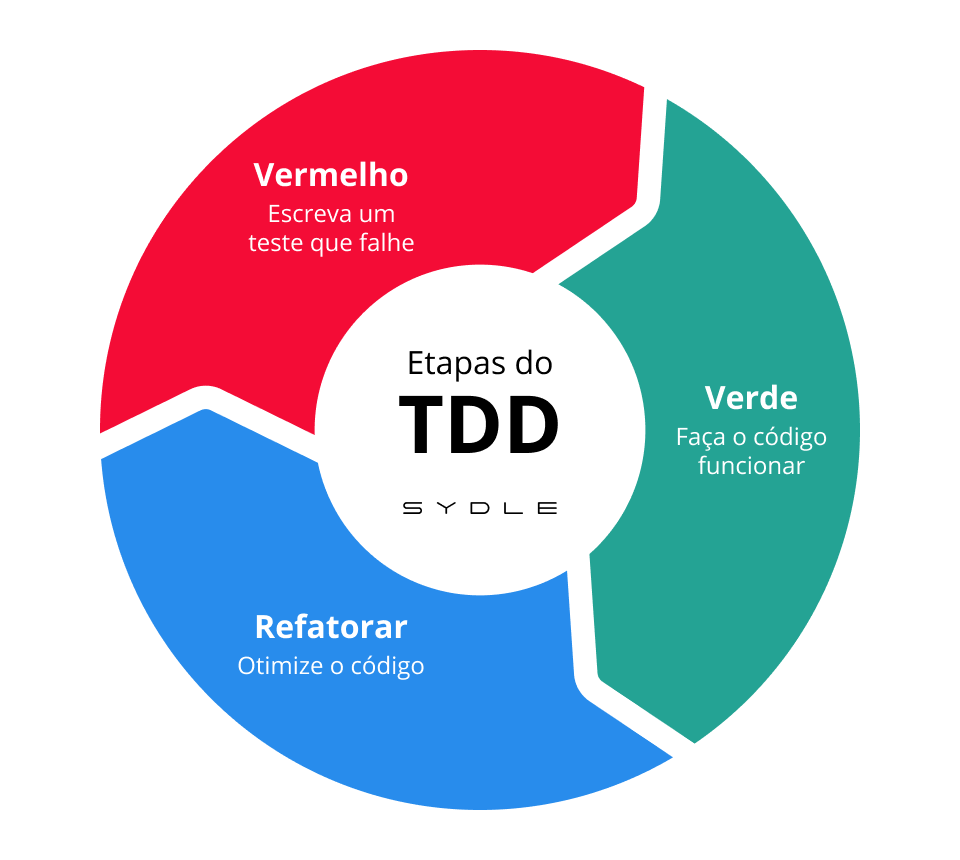
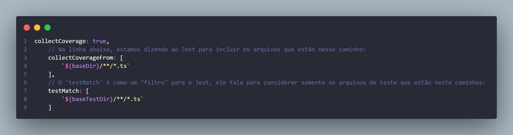

# Project: Password Checker

This project serves as a practical application of **Test-Driven Development (TDD)** principles, built during Section 4 of the *"Master unit testing with Node.js, TypeScript, Jest, and React"* course. Its core purpose is to hone skills in crafting high-quality TypeScript and Node.js software through rigorous unit testing with Jest.

## Test Driven Development Intro

It is exactly what it sounds - development driven by tests.

*For big projects, the objective would be to first achieve a very basic working state, and then write the tests.*

TDD is appropriate when we want to extend our already working application.

## Project Requirements

### Iteration 1

A password is invalid if:

- Length is less than 8 characters.
- Has no upper case letter.
- Has no lower case letter.

### Iteration 2

Return the reasons for invalidity.

### Iteration 3

Admin password should contain a number.

## Step 1

Inicialmente, precisamos alterar o nosso arquivo ``jest.config.ts`` para focar os testes e a cobertura em uma pasta específica (📁 secure_pass). Isso porque, como havíamos feito algumas alterações em outras etapas do curso, outras pastas estavam tendo cobertura de testes também.

Para isso, adicionamos no arquivo ``jest.config.ts`` duas constantes com os diretórios exigidos:

Depois, alteramos as configurações para que o Jest comece a procurar os arquivos a partir do **diretório base** do nosso projeto:
